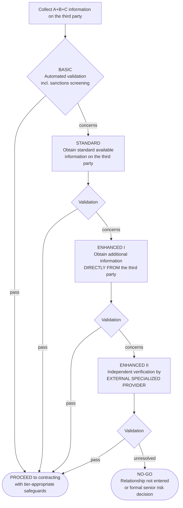

# The Third-Party Lifecycle — The Kruk Method
**Audience:** junior compliance professionals and non-specialists. Plain language, no idioms, translation-ready.
**Status:** backbone document for ACI-OS third-party methodology. Fresh expression of the method (supersedes all earlier graphics and drafts).
**Repo:** `04_Methodology/Third_Party_Lifecycle_Kruk_Method_v1_0.md`
**Elements:** E2 (Risk Assessment) · E3 (Standards & Controls) · E6 (Monitoring & Data) — this document is the third-party cross-cutting lens, written out in full.

---

## 1. The one idea everything else follows from

**The relationship is not the contract. The relationship starts long before the contract is signed and ends long after the contract is finished.**

Most compliance failures with third parties do not happen at signing. They happen:
- **before** — because nobody asked why this third party is needed at all;
- **during** — because nobody watched after onboarding;
- **after** — because nobody managed the ending: final payments, old invoices, data, and what the file must show years later.

Enforcement reality supports this focus: most major corruption cases involve an intermediary — an agent, distributor, consultant, or partner — not a direct payment. That is why every serious framework treats third parties as a priority risk. [FCPA Resource Guide] [DOJ ECCP 2024] [UKBA Principle 4 — due diligence] [ISO 37001]

**The method in one sentence:** treat every third party as a *lifecycle to be managed*, with the depth of checking and the strength of safeguards always **proportionate to risk** — never the same form for everyone.

---

## 2. The lifecycle — seven phases

### Phase 1 — NEED (before you even search)
The first compliance question is not "is this third party clean?" It is: **"Why do we need a third party at all?"**
- What exactly will they do that we cannot do ourselves?
- What will they be paid for — and is the compensation connected to real, describable work?
- If the honest answer is "relationships" or "access," slow down: that answer is the beginning of most enforcement cases.
A third party without a clear, legitimate business purpose fails here — before any screening.

### Phase 2 — RISK CLASSIFICATION (the three inputs)
Before any due diligence, classify the risk. Three inputs decide the level:

| Input | Question | Examples |
|---|---|---|
| **A — Service type** | What will they do for us? | Distribution and sales (high) · technical supply (medium) · pure logistics (lower) — the more they represent you or touch decisions, the higher |
| **B — Geography** | Where will they act? | Use a recognized index (e.g., Corruption Perceptions Index) as a starting point: high-risk vs. low-risk countries |
| **C — Red flags** | What is already visible? | Public officials involved · unusual payment requests · incomplete documentation · foreign or third-party accounts · recommended by a customer or official |

A + B + C together set the **risk level**. This is judgment supported by structure — not a mechanical score. [practitioner method — Kruk; consistent with DOJ ECCP risk-based expectations]

### Phase 3 — RISK-TIERED DUE DILIGENCE (the escalation ladder)
The core of the method: **due diligence depth escalates with risk, and each tier ends in a validation gate.** Pass the gate → proceed to contracting. Fail it → escalate one tier up. At the top, some relationships are simply not entered.

**Reading the ladder (for juniors):**
- **BASIC** — everyone gets this: identity, registration, sanctions and watch-list screening, automated where possible.
- **STANDARD** — public and database information: ownership, adverse media, litigation, licenses.
- **ENHANCED I** — you now ask the third party itself: questionnaires, ownership declarations to natural persons, references, documents.
- **ENHANCED II** — you stop relying on what they tell you: an external specialized firm verifies independently (local records, site visits, reputation inquiries).
- **NO-GO** — if the highest tier cannot resolve the concerns, the answer is the answer. **Unverified is not the same as clean.** A relationship that cannot be verified is not entered — or goes to a formal, documented senior risk decision, never a quiet exception.

**Two rules of the ladder:**
1. **Risk can move a case UP at any time; it never moves DOWN silently.** A red flag discovered at STANDARD sends the case to ENHANCED — a good feeling never sends it back to BASIC.
2. **Every gate produces a record:** what was checked, what was found, who validated, on what date. The record is not proof you were right; it is proof you assessed seriously.

### Phase 4 — CONTRACTING (safeguards scale with risk)
The contract is where due diligence findings become protections. Safeguards are cumulative — higher risk adds layers, it does not replace them:

| Risk tier | Contractual and program safeguards (cumulative) |
|---|---|
| All tiers | Anti-corruption and sanctions compliance clause · accurate books and records obligation · termination right for compliance breach |
| Standard and above | Compliance training or certification requirement · no sub-agents without approval · payment only to the contracting party, in the contract country |
| Enhanced tiers | Audit and information rights · ownership-change notification duty · re-screening triggers · enhanced payment controls |

The principle: **the same escalation logic that governed the checking now governs the protecting.** [practitioner method — Kruk; safeguard categories consistent with FCPA Guide and ISO 37001]

### Phase 5 — LIVING WITH THE THIRD PARTY (the longest phase, the most neglected)
Onboarding is not the end of due diligence — it is the start of monitoring:
- **Payments watch:** amounts, routes, payees, currencies — any change of payer or account is an event, not an administration detail.
- **Re-screening cadence** proportionate to risk (high-risk parties more often; and always against current lists — a screening result ages).
- **Change triggers** that reopen the assessment immediately: new country, new service scope, ownership change, new bank route, a red flag, a sanctions regime change, an incident.
- **Behavior signals:** requests for unusual payment routes, vague invoices, pressure for speed, resistance to documentation — each is information.

### Phase 6 — RENEWAL AND CHANGE
A renewal is not an administrative step; it is a **new decision on current facts**. An old clean screening is historical evidence, not current clearance. Before any renewal: refresh screening, re-confirm ownership, review the relationship's actual behavior since onboarding, and check that the contract's safeguards still match the current risk tier.

### Phase 7 — EXIT AND AFTERLIFE (the phase almost nobody manages)
The relationship does not end when the contract ends:
- **Ending well:** termination executed per the compliance clauses; final payments checked with the same discipline as the first ones; open orders and obligations wound down deliberately.
- **The afterlife:** outstanding invoices and receivables can still carry sanctions and corruption risk years later — even *collecting* money from a party whose status changed can be a prohibited act. Old third-party files must therefore be kept, and the party's status re-checked before any post-contract action.
- **Learning:** every exit — especially a bad one — feeds back into Phase 2: the risk model gets smarter with every relationship it has seen.

---

## 3. Ownership — who does what
- **The business owns the relationship** and the decision to engage, within policy.
- **Compliance owns the framework:** the risk model, the ladder, the gates, the evidence, the monitoring, and the escalation.
- **Nobody owns permission to skip a gate.** Exceptions are formal, documented, senior risk decisions — never informal accommodations.

---

## 4. The five sentences to remember (for juniors)
1. The relationship starts before the contract and ends after it.
2. Checking depth follows risk — never one form for everyone.
3. Unverified is not the same as clean.
4. Risk moves cases up the ladder; nothing moves down silently.
5. The file must show, years later, that you assessed seriously.

---

**Sources:** [DOJ ECCP 2024 — third-party management and risk-based due diligence] · [FCPA Resource Guide — intermediary risk, safeguards] · [UK Bribery Act Guidance, Principle 4 — proportionate, risk-based due diligence] · [ISO 37001 — business-associate due diligence and controls] · escalation-ladder design, three-input classification, validation gates, lifecycle framing: **[practitioner method — Tomasz Kruk, 25 years multinational compliance practice]**. Source links: see `07_Research/Source_Register_v0.1.md`.

*Change log: v1.0.1 — added Source Register reference for verified links. v1.0 — initial lecture version; fresh expression of the escalation model with lifecycle extension (Phases 1 and 5–7 added around the original ladder).*
